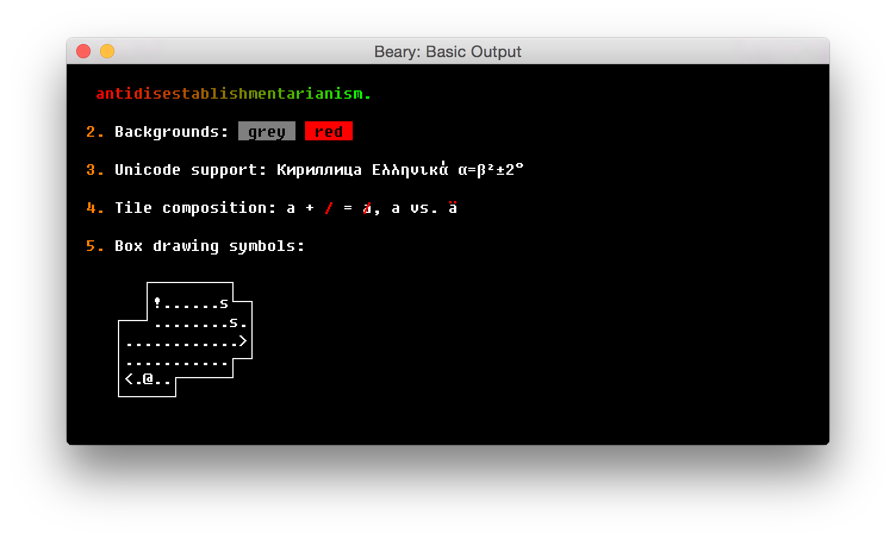

# Beary

Beary is a Pythonic wrapper for [bearlibterminal](http://foo.wyrd.name/en:bearlibterminal).  It's built on top of the provided Python library, which is more or less a direct mapping to the C bindings.

The purpose of this API is allow you to easily create pseudoterminal applications which work cross-platform but are much more capable than a stanard terminal.

Extra features include:

* Full RGB (plus alpha) color channels
* Arbitrary positioning
* Graphics support

## Examples

I'm currently porting all the bearlib native examples to the new API.  You can view the full source code in the [examples](./examples/) directory.

### Basic Output

View the [full source](./examples/basic_output.py)

